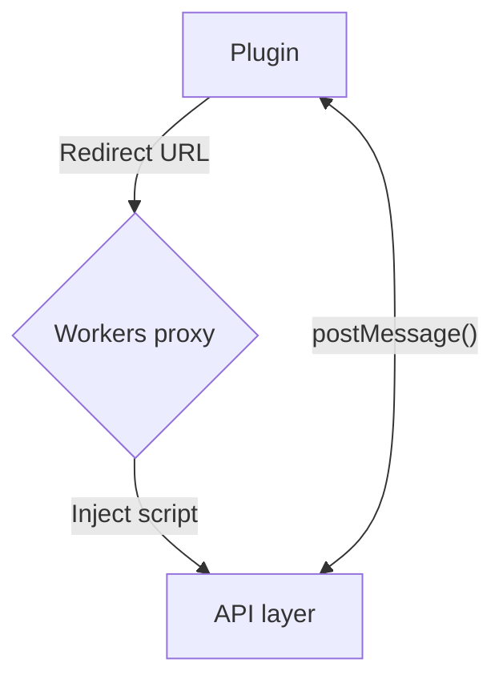

## Iframe Player

### Plugin

Registers a plugin in the app that will open `text/html` links (usually iframes) and redirects them to a proxy

### Workers proxy

A proxy that will intercept the request and return a response with the script injected

### API layer

A script that is embedded in a `<video/>` element and uses [postMessage()](https://developer.mozilla.org/en-US/docs/Web/API/Window/postMessage) to provide control to the application plugin

#### Supported players

- Native HTML5 Video - base media controls
- VenomPlayer - quality, audio
- Dash.js
- Hls.js - levels (quality)
